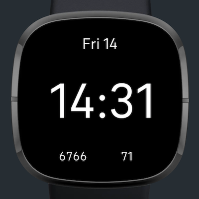
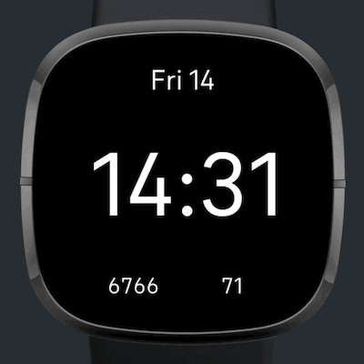

# Fitbit clock face - Minimal Steps + HR

A digital clock face with Steps and Heart-rate display. Made for the [Fitbit Sense](https://www.fitbit.com/global/us/products/smartwatches/sense).

## Features
The clock face that displays:
- Day of the Month and day of the Week
- Time
- Current Steps count
- Heart-rate

The background changes color according to the current heart-rate zone. It becomes yellow, orange and red when into the fat-burn, cardio and peak zones, accordingly. If the user has cusom zones, it becomes orange and red when inside and above the custom range.

## To-Dos
- Add icons
- Add localization

## Notes
- Work in progress
- Includes tests using [Jest](https://jestjs.io/).
